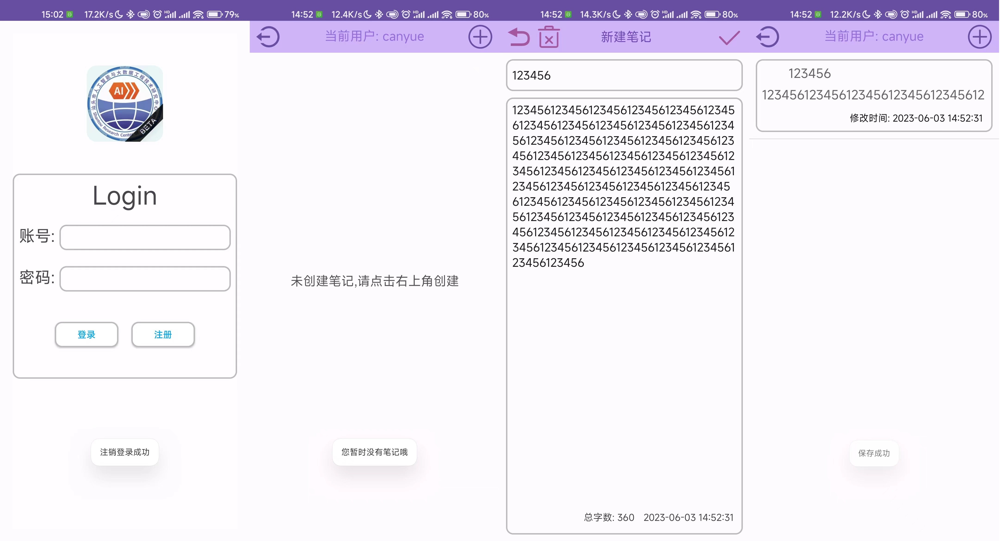

# Android-SerCabNoteBook

#### 介绍
个人Android期末大作业
#### 软件架构
基于Android 9版本

采用SQLite数据库+IO文件操作+FastJson等工具开发
#### 实现功能
注册,登录,注销

显示笔记列表,修改指定笔记,新增笔记,删除笔记,时间与字数记录,

登录信息IO缓存杜绝重复登录,不同用户笔记信息隔离保护隐私.
#### 应用截图

